## ソフトウェアの機能説明

この章では、FABOOL Softwareの主な機能について説明します。

### ソフトウェアの起動
FABOOL SoftwareドライバはPCの起動時にバックグラウンドで起動します。 
アプリケーション本体はローカル（PC内部）にありますので、Google ChromeもしくはFireFoxから、<a href="http://127.0.0.1:4444/">http://127.0.0.1:4444/</a>にアクセスします。

### メイン画面

加工データの読み込みや修正、加工パラメーター（レーザー出力とヘッドスピード）の設定などを行い、加工の開始や停止などの命令をコントロールする画面

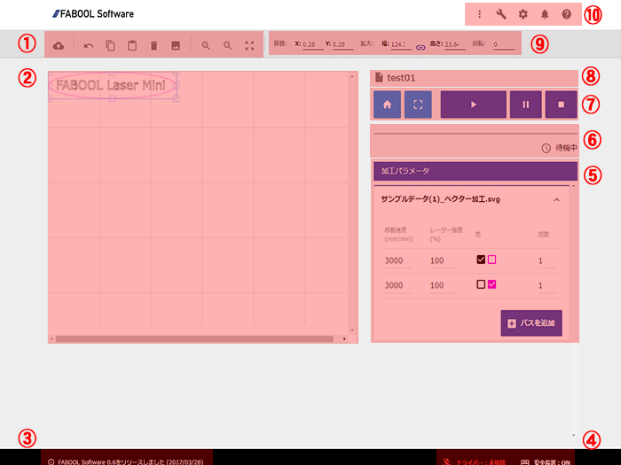
<ol>
<li><strong>編集ツールエリア</strong>： 
加工データの取り込み(インポート)、コピー、削除、UnDo、プロジェクトファイルの保存などの機能のアイコンがまとまっています。</li>

<li><strong>キャンバスエリア</strong>： 
取り込んだ加工データの表示、ドラック＆ドロップによる移動・拡大縮小・回転などの操作が行えます。 
※キャンバスエリアの左上が「原点」となります。なお、加工機の原点は原点復帰をしたときにレーザーヘッドが戻ってくる位置が原点です。
</li>

<li><strong>お知らせエリア</strong>： 
ソフトウェアのアップデートなどに関するお知らせを表示するエリア。</li>

<li><strong>状態表示エリア</strong>： 
・接続状態表示（左）：加工機との接続状態を「接続」、「未接続」で表示。また、ドライバーがインストールされていない場合は、「ドライバーなし」と表示される。 
・安全装置状態表示（右）：FABOOL Laser Mini本体のFoot switch、もしくは安全カバーを使用されている場合はそのドアスチッチの状態を表示。</li>

<li><strong>加工パラメーター設定エリア</strong>： 
取り込んだ加工データごと（SVGデータの場合は色ごと）の加工パラメーター（レーザー出力：0-100％、レーザーヘッドの移動速度：0-8,000mm/min)の設定を行う。 
※切断などを目的に、同じ動作を繰り返したい場合は、「回数」を増やすことで同じパスを繰り返し加工します。</li>

<li><strong>加工進捗プログレスバー</strong>： 
加工にかかる時間全体のうち、どの程度進捗しているかを示します。</li>

<li><strong>動作コントロールエリア</strong>： 
加工の開始、一時停止、停止等に加え、加工開始前に実際の加工範囲の確認を行う機能。 
※データを取り込んだ状態で「境界確認」ボタンを押すと、取り込んだデータを実際に加工する場合の境界範囲をレーザーヘッドが動きます。
</li>

<li><strong>プロジェクト名称の表示・変更エリア</strong>： 
現在開いているプロジェクト名称を表示。また、<strong>プロジェクト名称部分をクリックすると名称の変更が可能です。</strong></li>

<li><strong>オブジェクト設定タブ</strong>： 
取り込んだ加工データの位置や大きさ、角度などを値で入力し変更する。 
※キャンパスエリアで直接オブジェクトの移動や拡大縮小などを行うことも可能。
</li>

<li><strong>リンクエリア</strong>：以下へのリンクを配置 
・メニュー：プロジェクト一覧、新規プロジェクト作成やログアウト 
・メンテナンス：ソフトウェア上で軸移動の指示ができます 
・設定：使用する加工機の機種を選択し、X軸、Y軸方向の最大加工エリアを決定します 
・通知画面:読み込みエラー等に関する通知を表示 
・ヘルプ：バージョン確認、トラブルシューティングやお問い合わせ、リリースノートなどへのリンク</li>
</ol>

### 加工データの取り込みから加工開始まで

<strong></strong>
<strong>

この章では、FABOOL Softwareを使い加工データの取り込みからFABOOL Laser Mini本体を動かし始めるまでの流れを説明します。パスの色ごとの設定による、刻印と切断の使い分けなども説明します。

以下のサンプル加工データを例として使い、データの取り込みから加工開始までの流れをぜひ実際にやってみてください。

</strong>
<strong></strong>

まず、以下2つのサンプルデータをダウンロードし、ZIPファイルから取り出した状態でお好きな場所に保存して下さい。

<li>サンプルデータ(1) ベクター加工を<a href="https://www.smartdiys.com/manual/wp-content/uploads/2016/07/98df9688d1ae7b48865ccc7c95be1a65.zip" target="">こちらからダウンロードします</a>。</li>
<li>サンプルデータ(2) ラスター加工を<a href="https://www.smartdiys.com/manual/wp-content/uploads/2016/07/eb65586ef8f1d3f214c3f87c8ccf7b34.zip" target="">こちらからダウンロードします</a>。</li>

#### 電源とUSB接続

加工機を安定した台の上に設置し、安全カバーもしくは底面を保護する板を敷いた上で、電源ケーブルを加工機本体に差し込む。また、USBケーブルで加工機とPCを接続する。

#### レーザーヘッドの高さを調整する

FABOOL Laser Mini本体の下に加工素材を置き、高さ調整アクリルでレーザーヘッドの高さを調整する。 
※クラウドファンディングで本体をご注文のお客様は、付属の試し加工用素材の画用紙もしくはバルサ材をご利用ください。 
※高さ調整の方法は、組み立てマニュアルの該当箇所をご確認ください。

#### 新規プロジェクトを開く

メイン画面右上の「メニュー」から「新規プロジェクト作成」をクリックし、プロジェクト名を入力して新しいプロジェクトを作成する。

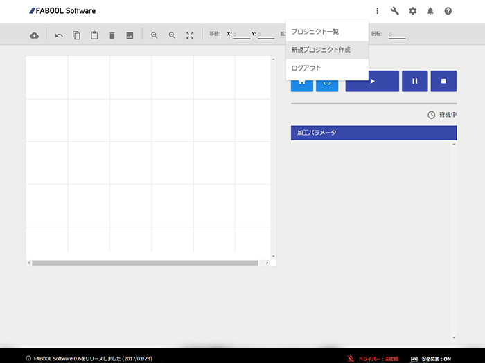 

#### 使用機種選択（加工エリア決定）

メイン画面右側の「プロジェクト設定エリア」にて、使用機種を選択し、X軸、Y軸方向の最大加工エリアを決定します。 
※以下では、FABOOL Laser Miniの使用している場合の画面キャプチャーを載せています。

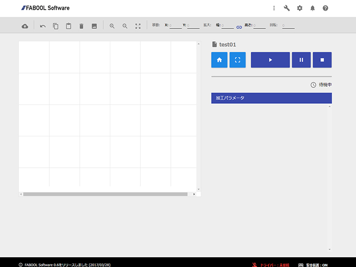 
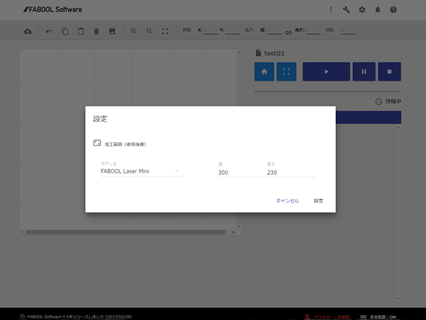 

#### サンプル加工データ（１）を取り込む

メイン画面、編集ツールエリアの「インポート」ボタンをクリックし、上記にてお客様のPCに保存したサンプル加工データ（１）をキャンバス上に取り込む。

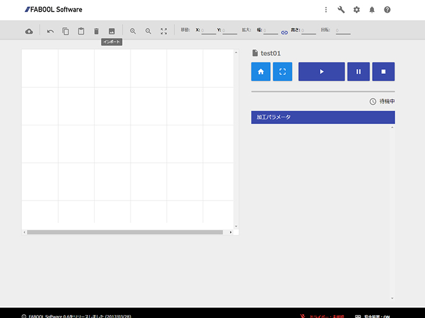 
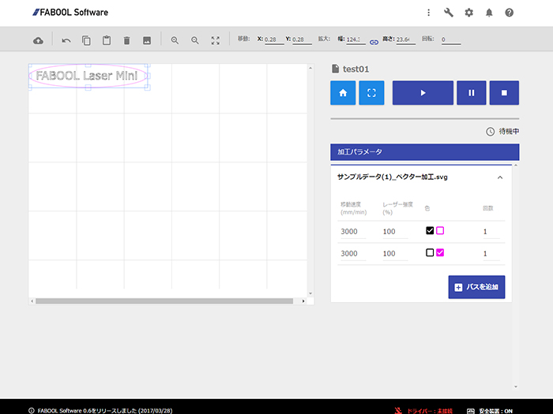 

キャンバス上で取り込んだデータをクリックして選択し、場所を移動したり、その四隅をドラッグ＆ドロップして適当な大きさに変更することが出来ます。 
もしくは、キャンバス上でデータをクリックして選択した上で、<strong>右側の「オブジェクト設定」でX軸Y軸方向の位置や、大きさ、回転などを数値で設定することも可能です。</strong>

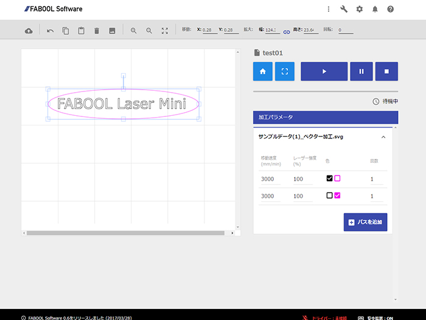 

#### サンプル加工データ（２）を取り込む

次に、サンプル加工データ（２）を取り込み、以下のように2つのデータが重ならないように配置する。

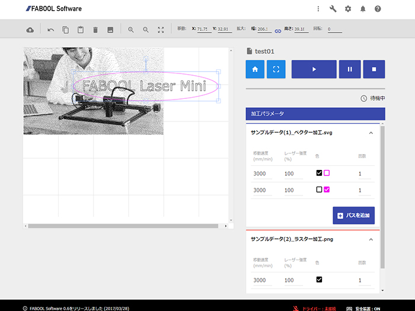 
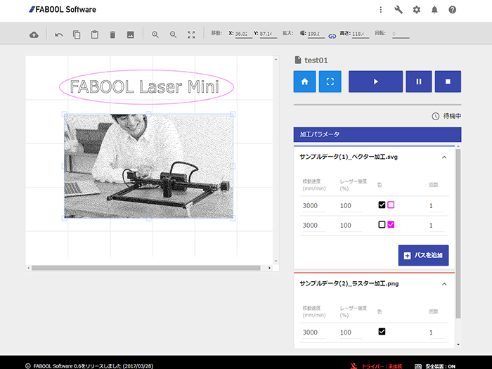 

#### 加工範囲を確認する

動作コントロールエリアの「境界確認」ボタンを押して、加工範囲の大きさを確認する。

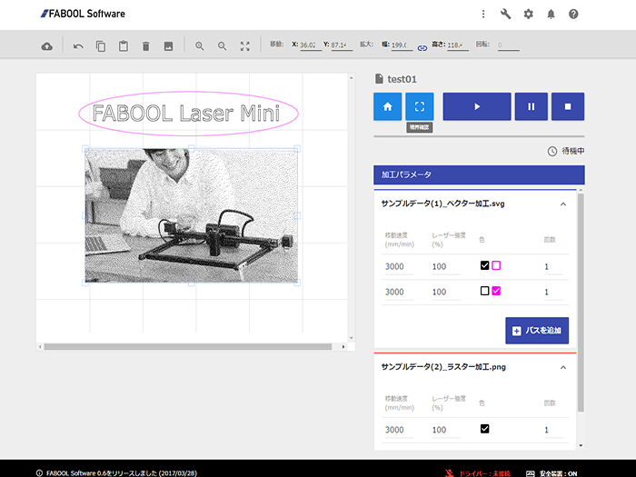 

#### 加工パラメーターを設定する

加工パラメーター設定エリアにて、各データごとにレーザー出力とヘッドスピード、および繰り返し回数を設定する。（SVGの場合のみ色ごとに別々のパラメーターが設定可能です。DXFや画像データについては色分けによる設定が出来ません。）

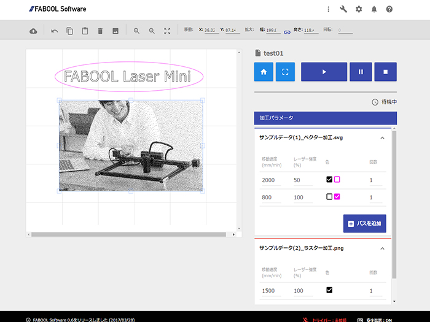

※<strong>サンプルデータ(1)には黒色とピンク色の2色の要素が含まれています。例えば、黒色の線は切断せず、一方ピンク色の線は繰り返し加工で切断するなどの設定が可能です。</strong>

#### 加工開始する
加工開始ボタンを押して加工を開始します。
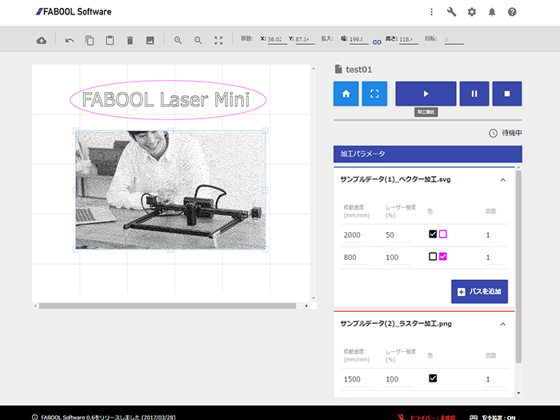

### その他機能

#### プロジェクトのインポート
ver.2.8.0以降ではFABOOL softwareよりエクスポートした加工データのインポートが可能になりました。下記の画像のようにプロジェクトメニューに「プロジェクトをインポート」が追加されました。 
※ver.2.8.0を使用する前に必ずブラウザのキャッシュのクリアを行っていただきますようお願いします。

#### バージョンの確認
コントローラーとドライバーのバージョンは　ハテナアイコン＞バージョン　からご確認いただけます。 
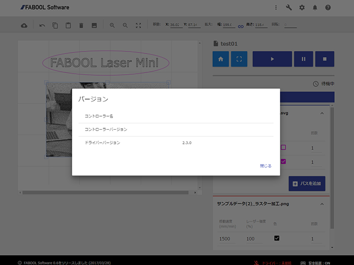 

#### 軸移動
メンテナンス（スパナアイコン）から、軸の調節をする際に、手動ではなくソフトウェアから軸移動の指示をだすことができます。 
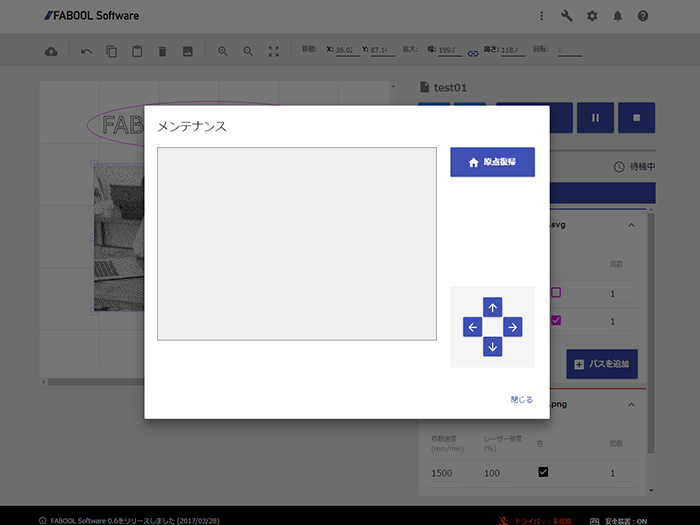 

トラブルシューティング

<strong>※動作に異常を感じる、もしくは加工が正しく行われない場合は以下をご参照ください</strong> 

＜加工動作はするがレーザーが照射されない場合＞ 
加工機の”足”に取り付けたFoot switchはしっかり押された状態かご確認ください。 
Foot switchが浮いている状態ですと、安全のためレーザー光が照射されない仕様となっております。 
なお、Foot switchがしっかりと押されている場合は、FABOOLソフトウェア上の状態表示エリアにある「安全装置」が緑色となります。 

＜DCファンが回らない場合＞ 
レーザーユニット上部のDCファンおよびPCBケース部のDCファンの両方が回らない場合は、ACアダプターがしっかりと奥まで差し込まれているかをご確認ください。（奥まで差し込まれている場合は基板のLEDが点灯します。）

レーザーユニット上部のDCファンのみ回らない場合は、Laserケーブルの配線を再度ご確認ください。 
一方、PCBケース部のDCファンのみ回らない場合は、DCファンと基板の接続部分のコネクターがしっかりと刺さっているかをご確認ください。 

その他の異常については<a href="https://www.smartdiys.com/support/troubleshooting.html" target="">トラブルシューティング</a>をご参照ください。

